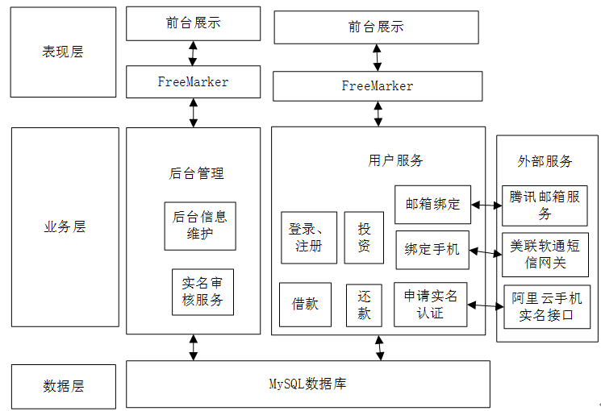
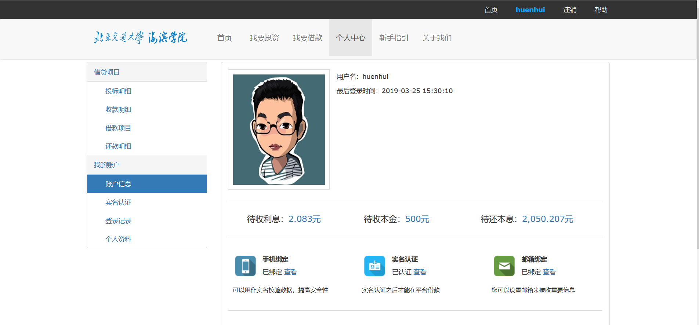
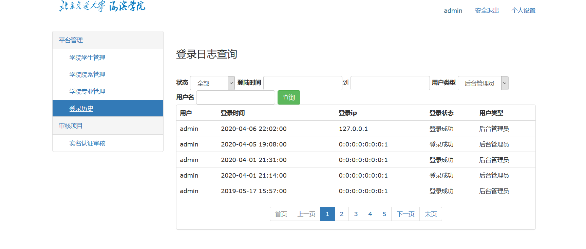

# 海滨学院贫困帮扶借款交易平台的设计与实现
这是一套采用SSM框架和freemarker模板引擎开发的一套p2p借款平台，
外部引用了阿里云的手机实名认证接口，美联软通的短信发送接口和腾讯邮箱的发件接口。

## 系统简介
系统包含两类用户，普通用户和管理员。下面展示系统功能结构图、用户视图和管理员视图。
详细文档可查看仓库doc目录。

### 系统功能结构图

### 用户视图

### 管理员视图

